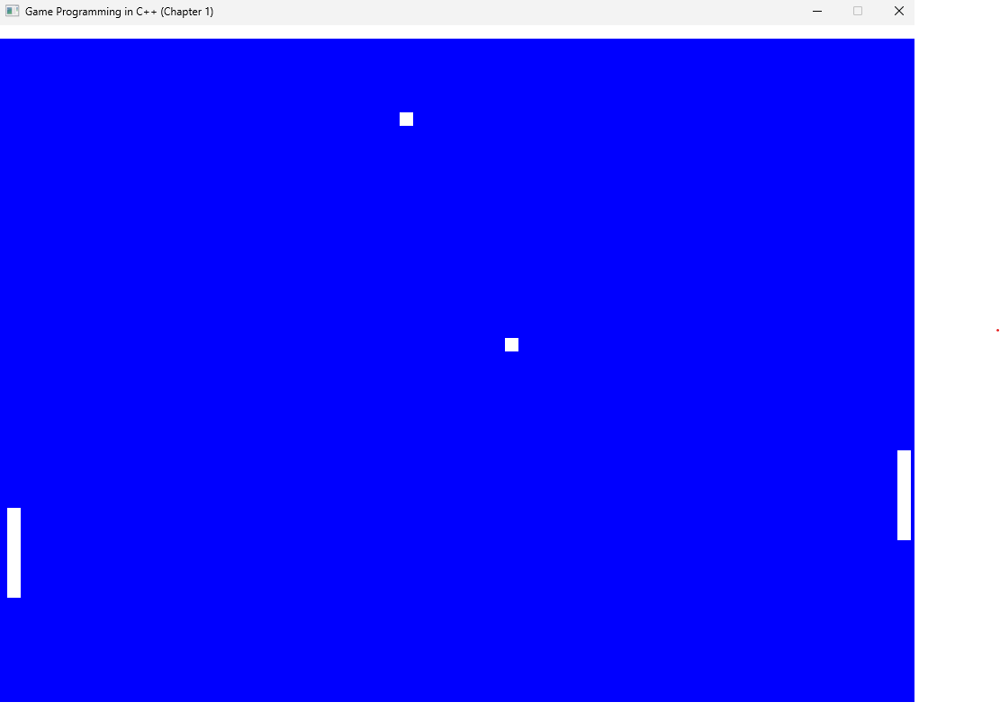

### Chapter 1 Pinball
Use SDL as a framework for implementing a 2D pinball game with a simple game loop using `ProcessInput`, `UpdateGame`, and `GenerateOutput`.
As an added challenge, there are two paddles and two balls.

